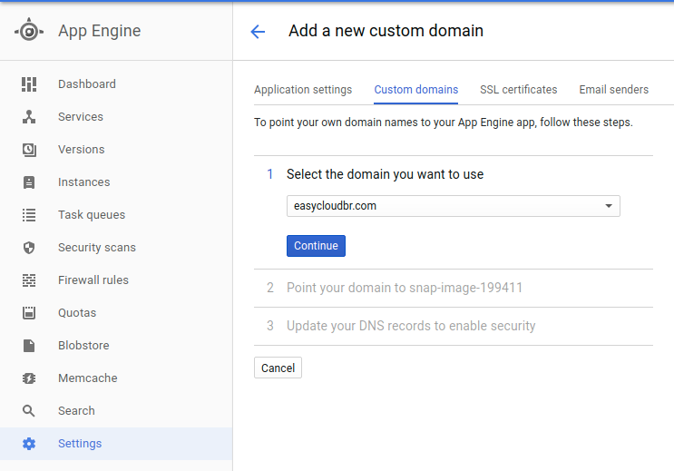

Usando Let’s Encrypt no App Engine
---
[Let’s Encrypt](https://letsencrypt.org/) é um CA (Certificate Authority) open, ou seja, totalmente free, com ele podemos gerar certificados digitais (SSL) para websites, microservices entre outros casos de uso.

Tecnologias
---
Este artigo está utilizando as seguintes tecnologias:

  - [Let’s Encrypt](https://letsencrypt.org/)
  - [Python](https://www.python.org/)
  - [Flask](http://flask.pocoo.org/)
  - [Google App Engine](https://cloud.google.com/appengine/)
  
 Pré Requisitos
  ---
 Para executar o exemplo do Let's Encrypt você vai precisar de um projeto no [Google Cloud Platform](https://console.cloud.google.com) e ter instalado o [Google Cloud SDK](https://cloud.google.com/sdk/downloads?hl=pt-br).
 Para saber mais sobre como criar um projeto no Googe Cloud clique [aqui](https://cloud.google.com/sdk/downloads?hl=pt-br) e siga as instruções para criar seu projeto.
 
Digite no terminal do seu sistema operacional
```
gcloud init
```
Siga as instruções e logue no seu projeto do GCP (Google Cloud Platform).

Faça o download do repositório com o código fonte:

```
https://github.com/carlosrgomes/sample-letsencrypt.git
```

Entre no diretório sample-letsencrypt e faça o deploy da sua aplicação no App Engine com o comando:
```
gcloud app deploy
```

Faça o download do [Let’s Encrypt](https://letsencrypt.org/) em outro diretório:

```
git clone https://github.com/letsencrypt/letsencrypt
cd letsencrypt
./letsencrypt-auto --help
```

Configurando seu domínio
---
No Console do GCP temos que entrar no Settings do App Engine conforme pode observar na imagem.

markdown



